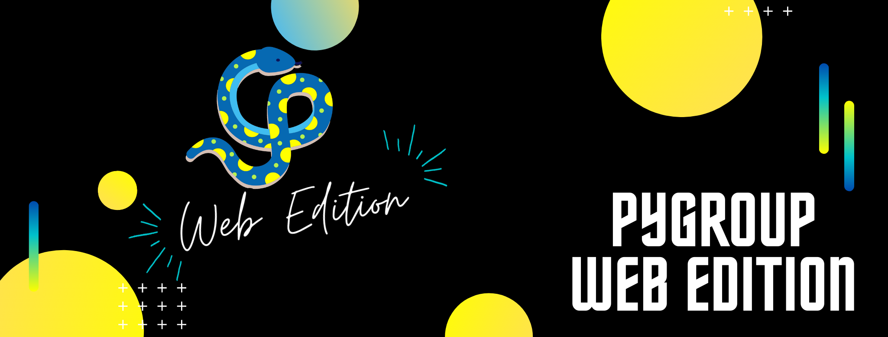

<p align="center">
  
</p>

# Pygroup Web Edition Shop
## Let's start the party 🎉
This is the practice project to cover all the basic topics to build a Flask simple application in the workgroup Pygroup.
Be careful to read this README before cloning the repo and execute the app.

### Before ... 📋

_You will need this stuff to run the project_

```
Python version 3.x
```

### Installation 🔧

_Create virtual environment with your preferred tool. We suggest venv_

```
python -m venv venv
```

_Activate the venv_

```
source venv/bin/activate
```

_Install all the requeriments_

```
pip install -r requirements.txt
```

### Run app 🏃

_Execute the app in the root directory_

```
flask run
```
### Tests 💙

_To run the tests, use the command:_

```
pytest
```

## Built with ❤️

_Tools_

* [Python](www.python.org) - Programming language
* [Flask](https://flask.palletsprojects.com/en/1.1.x/) - Web micro-framework
* [SQLAlchemy](www.sqlalchemy.org) - SQL ORM

## Authors ✒️
* Javier Felipe Castañeda - [jfcc3101](https://github.com/jfcc3101)
* María Camila Guerrero Giraldo - [mcguegi](https://github.com/mcguegi/)
